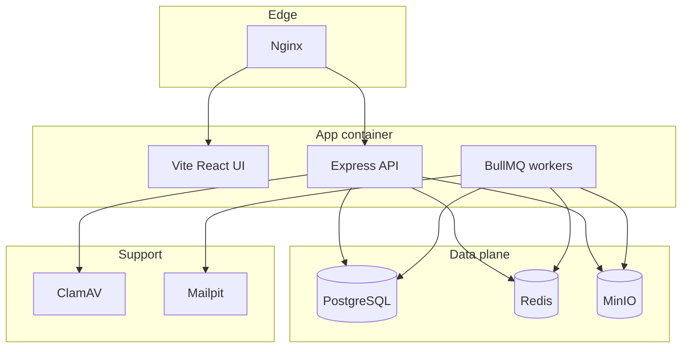

# Vellum Build Plan

Source of truth: [Vellum_Comprehensive_Design_Document.md](/apps/vellum/Vellum_Comprehensive_Design_Document.md)

**Current state:** Vite + React 19 starter only (`[src/App.tsx](/apps/vellum/src/App.tsx)`). `[vite.config.ts](/apps/vellum/vite.config.ts)` already wires `vite-plugin-node` to a missing `[src/server.ts](/apps/vellum/src/server.ts)`. No Docker, Prisma, API, workers, or product UI.

**Delivery strategy (your choices):** Infra and API skeleton first, then vertical feature slices. Upload auth via API key; dashboard auth via a dev mock until WorkOS lands in a later slice.

---

## Target architecture




---

## Phase 0 — Repository and project layout

**Goal:** Establish a consistent `src/` layout and env contract before containers.


| Area         | Actions                                                                                                                                                                                                                                                                          |
| ------------ | -------------------------------------------------------------------------------------------------------------------------------------------------------------------------------------------------------------------------------------------------------------------------------- |
| Git          | Initialize repo; add `.gitignore` (`.env`, `node_modules`, `dist`, `certs/`)                                                                                                                                                                                                     |
| Env          | Add `[.env.example](/apps/vellum/.env.example)` mirroring design doc §4.2 (`DATABASE_URL`, `REDIS_URL`, `MINIO_`*, `CLAMAV_`*, `APP_URL`, lifecycle defaults, `EMAIL_PROVIDER=local`)                                                                                            |
| Layout       | Create folders per design doc: `src/server.ts`, `src/routes/`, `src/middleware/`, `src/lib/{prisma,redis,storage,email,clamav}/`, `src/queues/`, `src/workers/`, `prisma/`                                                                                                       |
| Dependencies | Add runtime deps: `express`, `@prisma/client`, `prisma`, `bullmq`, `ioredis`, `@aws-sdk/client-s3`, `@aws-sdk/s3-request-presigner`, `argon2`, `zod`, `nodemailer`, `date-fns`, `multer` (or busboy), `express-rate-limit`; dev: `@types/express`, `clamav.js` or TCP client lib |
| Scripts      | Extend `[package.json](/apps/vellum/package.json)`: `db:migrate`, `db:generate`, `worker` (start BullMQ workers), keep `dev` via Vite                                                                                                                                            |


**Exit criteria:** `npm run dev` starts Vite; `src/server.ts` exists and returns `{ status: "ok" }` on `GET /api/health`.

---

## Phase 1 — Infrastructure (Docker Compose + Nginx)

**Goal:** Runnable local stack matching design doc §4.1 with Appendix C.2 health gating.


| Deliverable                                             | Details                                                                                                                                                     |
| ------------------------------------------------------- | ----------------------------------------------------------------------------------------------------------------------------------------------------------- |
| `[docker-compose.yml](/apps/vellum/docker-compose.yml)` | Services: `app`, `postgres`, `redis`, `minio`, `clamav`, `mailpit`, `nginx`; named volumes; ClamAV `healthcheck` + `app.depends_on.clamav: service_healthy` |
| `[Dockerfile](/apps/vellum/Dockerfile)`                 | Multi-stage: install deps, `prisma generate`, build Vite, run API + workers in prod (dev can mount source)                                                  |
| `[nginx.conf](/apps/vellum/nginx.conf)`                 | Route `/` → Vite (dev proxy or static), `/api` → Node `:3000`; TLS placeholders under `certs/`                                                              |
| MinIO bootstrap                                         | Init script or app startup: create bucket `vellum-documents` if missing                                                                                     |
| Redis                                                   | `command: redis-server --appendonly yes` (Appendix C.5)                                                                                                     |


**Exit criteria:** `docker compose up` brings all services healthy; Mailpit UI on `:8025`; Postgres accepts connections; MinIO console reachable.

---

## Phase 2 — Data layer (Prisma)

**Goal:** Persist metadata and audit per design doc §5.

Implement `[prisma/schema.prisma](/apps/vellum/prisma/schema.prisma)` exactly as specified:

- `Document` with three TTL fields, `downloadToken`, `passwordHash`, `isUsed`, nullable `s3Key`, `deletedAt`
- `AuditLog` with `AuditEventType` enum, nullable `documentId` / `userId`, JSON `metadata`, `expiresAt`
- FK: `AuditLog.document` with `onDelete: SetNull` (§5.2)

Add `[src/lib/prisma.ts](/apps/vellum/src/lib/prisma.ts)` singleton.

**Exit criteria:** `prisma migrate dev` applies schema; manual insert/select works from a smoke script.

---

## Phase 3 — API skeleton + shared libraries

**Goal:** Express app wired through existing Vite Node plugin, with auth middleware stubs and storage/redis clients—no business flows yet.

```typescript
// src/server.ts — structure
import express from "express";
import { healthRouter } from "./routes/health";
import { uploadRouter } from "./routes/upload";   // stub 501
import { verifyRouter } from "./routes/verify";   // stub 501
import { documentsRouter } from "./routes/documents";
import { authRouter } from "./routes/auth";

const app = express();
app.use(express.json());
app.use("/api", healthRouter);
app.use("/api/upload", apiKeyAuth, uploadRouter);
app.use("/api/verify", verifyRouter);
app.use("/api/documents", devAuth, documentsRouter);
app.use("/api/auth", authRouter);
```


| Module         | File                                       | Responsibility                                                                               |
| -------------- | ------------------------------------------ | -------------------------------------------------------------------------------------------- |
| S3/MinIO       | `src/lib/storage/s3Client.ts`              | AWS SDK client + `generatePresignedUrl()` (§6.4)                                             |
| Redis          | `src/lib/redis.ts`                         | Shared BullMQ connection                                                                     |
| ClamAV         | `src/lib/clamav.ts`                        | TCP scan; **fail closed** if unreachable (§6.2, C.2)                                         |
| Queues         | `src/queues/{email,audit,cleanup}Queue.ts` | Queue instances + `logEvent()` helper (§11.2)                                                |
| Upload auth    | `src/middleware/apiKeyAuth.ts`             | Validate `Authorization: Bearer <API_KEY>` from env                                          |
| Dashboard auth | `src/middleware/devAuth.ts`                | Dev mock: header `X-Dev-User-Email` → `req.user`; document in code that WorkOS replaces this |
| Types          | `src/types/express.d.ts`                   | Augment `Request` with `user`                                                                |


**Exit criteria:** All five routes from §7.1 exist and return structured placeholders; `GET /api/health` checks DB + Redis + ClamAV reachability.

---

## Phase 4 — Feature slice: Upload pipeline

**Goal:** End-to-end machine upload (Path not involving dashboard).


| Step       | Implementation                                                                                |
| ---------- | --------------------------------------------------------------------------------------------- |
| Validation | Zod schema from §7.2 including `linkTtl <= fileTtl` refine (C.6)                              |
| Multipart  | Accept file + JSON fields; size limits via env                                                |
| Scan       | Stream to ClamAV before any S3 write                                                          |
| Store      | Put object in MinIO; persist `Document` row with Argon2 `passwordHash`, token, TTL timestamps |
| Response   | `201` + `id` + **password channel warning** in body (C.4)                                     |
| Async      | Enqueue `email-queue` job `send-initial-link`                                                 |


**Exit criteria:** `curl` upload with API key creates DB row + S3 object; job appears in Redis queue (worker can still be stubbed).

---

## Phase 5 — Feature slice: Guest download (Path A)

**Goal:** Recipient flow without WorkOS.


| Piece              | Details                                                                                                                                                 |
| ------------------ | ------------------------------------------------------------------------------------------------------------------------------------------------------- |
| `POST /api/verify` | Full logic from §7.3: token lookup, link expiry 410, Argon2 verify, presigned URL, `isUsed = true`, audit enqueue                                       |
| Rate limit         | `express-rate-limit` on verify: 5 attempts / 15 min per token (C.1)                                                                                     |
| Frontend           | Replace starter UI with `/verify/:token` page: password form, error states (expired link, wrong password, file scrubbed), copy for presigned race (C.3) |
| Routing            | React Router (or Vite file-based routes): `/verify/:token`, minimal layout                                                                              |


**Exit criteria:** Recipient with token + password gets 30s download URL; failed password audited; expired link shows actionable message.

---

## Phase 6 — Feature slice: Email + audit workers

**Goal:** Decouple I/O from HTTP per §10–§11.


| Worker        | Queue                           | Behavior                                                                                                           |
| ------------- | ------------------------------- | ------------------------------------------------------------------------------------------------------------------ |
| `emailWorker` | `email-queue`                   | `EmailService` + strategy providers (`LocalEmailProvider`, stub `SesEmailProvider`); log `EMAIL_`* via audit queue |
| `auditWorker` | `audit-queue`                   | Persist `AuditLog` with `expiresAt` from `REPORTING_LIFETIME_YEARS`                                                |
| Email factory | `src/lib/email/EmailService.ts` | `EMAIL_PROVIDER=local                                                                                              |


**Optional hardening (C.5):** `FailedAuditLog` table + sync fallback when Redis enqueue fails.

**Exit criteria:** Upload triggers email visible in Mailpit; verify success/failure rows in `AuditLog`.

---

## Phase 7 — Feature slice: Lifecycle cleanup workers

**Goal:** Self-cleaning vault per §9.


| Worker              | Schedule                       | Behavior                                                                        |
| ------------------- | ------------------------------ | ------------------------------------------------------------------------------- |
| `fileScrubWorker`   | Hourly cron on `cleanup-queue` | Delete expired S3 objects, null `s3Key`, set `deletedAt`, audit `FILE_SCRUBBED` |
| `recordScrubWorker` | Monthly cron                   | Delete expired `AuditLog` then `Document` where `recordExpiresAt < now`         |


Register repeatable jobs on worker process startup (BullMQ `upsertJobScheduler` or equivalent).

**Exit criteria:** Backdated test document gets scrubbed from MinIO and DB metadata updated.

---

## Phase 8 — Feature slice: Dashboard + link regeneration (Path B)

**Goal:** Authenticated recipient view with dev mock auth; WorkOS-ready interfaces.


| Backend                                | Details                                                                                                                  |
| -------------------------------------- | ------------------------------------------------------------------------------------------------------------------------ |
| `GET /api/documents`                   | `WHERE recipientEmail = req.user.email`                                                                                  |
| `POST /api/documents/:id/request-link` | §7.4: ownership check, file-not-scrubbed, cap `linkExpiresAt` at `fileExpiresAt`, rotate token, enqueue regenerate email |
| WorkOS prep                            | `src/lib/auth/workos.ts` interface + `DevAuthProvider` now; swap to `@workos-inc/node` in Phase 9 without route changes  |


| Frontend     | Details                                                                                         |
| ------------ | ----------------------------------------------------------------------------------------------- |
| UI kit       | Add shadcn/ui + Tailwind (design doc §2)                                                        |
| `/dashboard` | Document list, status badges (link active / expired / file scrubbed), "Send access link" action |
| Dev login    | Simple page setting `X-Dev-User-Email` in session/localStorage for API calls                    |


**Exit criteria:** Dev user sees only their documents; regeneration sends Mailpit email; download still requires Path A (no direct download from dashboard).

---

## Phase 9 — WorkOS integration (replace dev mock)

**Goal:** Production-grade SSO per §8.


| Task                     | Details                                                                                             |
| ------------------------ | --------------------------------------------------------------------------------------------------- |
| SDK                      | `@workos-inc/node`; env: `WORKOS_API_KEY`, `WORKOS_CLIENT_ID`, `WORKOS_REDIRECT_URI`                |
| `GET /api/auth/callback` | Code exchange, session/JWT cookie, `USER_LOGIN` audit, redirect `/dashboard`                        |
| Middleware               | JWT/session validation replaces `devAuth` when `NODE_ENV=production` or flag `AUTH_PROVIDER=workos` |
| Upload                   | Optional: accept WorkOS JWT on `/api/upload` in addition to API key (§8.1)                          |
| Frontend                 | "Sign in with SSO" button; remove dev email header in prod builds                                   |


**Exit criteria:** Real WorkOS login populates dashboard; API key upload still works for integrators.

---

## Phase 10 — Hardening, tests, and docs


| Area           | Actions                                                                                                                 |
| -------------- | ----------------------------------------------------------------------------------------------------------------------- |
| Security       | Helmet, CORS policy, request ID, structured logging; document two-key model in API README                               |
| Tests          | Integration tests against Compose stack: upload → email job → verify → audit row; worker scrub tests with clock mocking |
| CI             | GitHub Action: lint, `tsc -b`, `prisma validate`, integration job with service containers                               |
| Product README | Replace stock Vite README with setup (`docker compose up`, migrations, Mailpit, dev auth headers)                       |


**Exit criteria:** CI green; README enables a new developer to run full Path A + Path B locally.

---

## Phase 11 — AWS migration (deferred)

Per design doc §13—**no code changes** if env-driven abstractions are correct. Execute only after v1 local stack is stable:

1. Secrets Manager + ECS Fargate task definitions
2. RDS + ElastiCache + S3 bucket
3. ALB + ACM replaces Nginx
4. `EMAIL_PROVIDER=ses`
5. ClamAV → Lambda on S3 trigger (high effort; separate sub-project)

---

## Suggested directory tree (end state)

```text
/apps/vellum
├── prisma/schema.prisma
├── docker-compose.yml
├── Dockerfile
├── nginx.conf
├── .env.example
├── src/
│   ├── server.ts
│   ├── routes/          # upload, verify, documents, auth, health
│   ├── middleware/      # apiKeyAuth, devAuth, workosAuth (phase 9)
│   ├── lib/
│   │   ├── prisma.ts
│   │   ├── redis.ts
│   │   ├── clamav.ts
│   │   ├── storage/s3Client.ts
│   │   ├── email/       # IEmailProvider, Local, Ses, EmailService
│   │   └── auth/        # workos + dev providers
│   ├── queues/
│   ├── workers/
│   └── pages/ or components/  # React: VerifyPage, Dashboard
└── Vellum_Comprehensive_Design_Document.md
```

---

## Milestone summary


| Phase | Milestone       | User-visible outcome                      |
| ----- | --------------- | ----------------------------------------- |
| 0–1   | Infra ready     | `docker compose up` healthy               |
| 2–3   | API skeleton    | Health + stub routes                      |
| 4     | Upload slice    | API clients can send documents            |
| 5     | Download slice  | Recipients download with token + password |
| 6     | Workers slice   | Emails + audit trail automatic            |
| 7     | Cleanup slice   | Expired files/records purged              |
| 8     | Dashboard slice | Recipients manage links (dev auth)        |
| 9     | WorkOS slice    | Real SSO                                  |
| 10    | Production prep | CI, tests, docs                           |
| 11    | AWS             | Cloud deployment                          |


---

## Key design constraints to preserve in every slice

1. **Two-key downloads:** Never bypass email link + file password, even for dashboard users (§6.1).
2. **No file bytes through Node:** Only presigned URLs after verify (§6.3).
3. **ClamAV fail-closed:** Reject upload if scanner unavailable (§6.2, C.2).
4. **TTL invariants:** `linkTtl <= fileTtl` at upload; regeneration capped at `fileExpiresAt` (§9.4).
5. **Fire-and-forget audit:** Use `logEvent()` everywhere; consider `FailedAuditLog` fallback (C.5).

---

## Risks and mitigations


| Risk                                    | Mitigation                                                                                           |
| --------------------------------------- | ---------------------------------------------------------------------------------------------------- |
| ClamAV slow startup                     | Compose healthcheck + `depends_on: service_healthy` (already in plan)                                |
| `isUsed` locks user after browser crash | UI copy + optional 3-retry window before permanent `isUsed` (C.3—implement if UX testing demands it) |
| Password in same email as link          | Upload response warning + integrator docs (C.4)                                                      |
| vite-plugin-node + workers              | Run workers as separate process (`npm run worker`) in same container or sidecar in Compose           |


