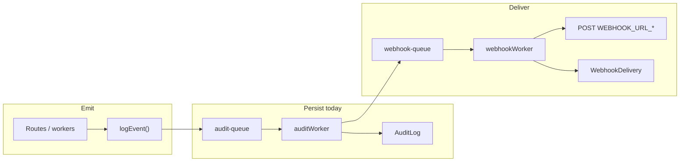

# Audit events and webhooks

Vellum records compliance and security events in the `AuditLog` table. Integrators can subscribe to those events via outbound HTTP webhooks (roadmap item 11 — implemented).

**Source of truth for enum values:** [`prisma/schema.prisma`](../prisma/schema.prisma) (`AuditEventType`).

**Emit API:** `logEvent()` in [`src/server/queues/auditQueue.ts`](../src/server/queues/auditQueue.ts) → BullMQ `audit-queue` → [`auditWorker`](../src/server/workers/auditWorker.ts) → Postgres.

**Query / export:** Admin API `GET /api/admin/audit-logs` (JSON or CSV). See [CONFIG.md](./CONFIG.md) (`AUDIT_EXPORT_MAX_LIMIT`).

**Process errors:** Operational failures (HTTP 4xx/5xx, worker crashes) are recorded separately in `ProcessError` / `DeadLetter`. See [ERROR_HANDLING.md](./ERROR_HANDLING.md). An audit event and a process error may share a `correlationId` (for example verify wrong password).

---

## Pipeline



Every `AuditLog` row includes:

| Field | Description |
|-------|-------------|
| `auditLogId` | Primary key |
| `eventType` | `AuditEventType` enum value |
| `createdAt` | Insert time (UTC) |
| `documentId` | `Document.documentId` when the event relates to an envelope (nullable) |
| `communicationId` | `Communication.communicationId` when the event relates to a verify link (nullable) |
| `userId` | Dashboard `User.userId` when applicable (nullable) |
| `ipAddress` | Client IP when emitted from HTTP (nullable) |
| `userAgent` | Client user-agent when emitted from HTTP (nullable) |
| `metadata` | JSON object — event-specific details |
| `expiresAt` | Purge horizon (`REPORTING_LIFETIME_YEARS`) |
| `processErrorId` | Linked operational error, when resolved (nullable) |

---

## Implemented event types

These values exist in the Prisma enum today.

| Event | Description | Emitted by | `documentId` | `userId` | Typical `metadata` |
|-------|-------------|------------|--------------|----------|-------------------|
| `USER_LOGIN` | Dashboard user signed in | [`auth.ts`](../src/server/routes/auth.ts) — WorkOS callback or dev `POST /api/auth/dev/request-login` when already verified | — | ✓ | `email`, `provider` (`WorkOS` \| `dev`), `kind` |
| `EMAIL_INITIAL_SENT` | First download-link email dispatched after upload | [`emailWorker`](../src/server/workers/emailWorker.ts) — job `send-initial-link` | ✓ | — | `type: "INITIAL"` |
| `EMAIL_REGENERATE_SENT` | Regenerated download-link email dispatched | [`emailWorker`](../src/server/workers/emailWorker.ts) — job `send-regenerate-link` | ✓ | — | `type: "REGENERATE"`, `requestedBy` (user id) |
| `FILE_DOWNLOAD_SUCCESS` | Recipient passed password verify and received a presigned URL | [`verify.ts`](../src/server/routes/verify.ts) — `POST /api/verify` | ✓ | — | `reverifyAttempt`, `isFinalConsumption`, `downloadCount`, `maxDownloads` |
| `FILE_DOWNLOAD_FAILED` | Download verification failed | [`verify.ts`](../src/server/routes/verify.ts) — wrong password only today | ✓ | — | `correlationId`, `reason` (e.g. `Incorrect password`) |
| `FILE_PURGED` | Object removed from storage by lifecycle worker | [`filePurgeWorker`](../src/server/workers/filePurgeWorker.ts) | ✓ | — | `originalS3Key` |
| `LINK_REVOKED` | All active communications on an envelope revoked; shared file retained | [`revoke-document.ts`](../src/lib/revoke-document.ts) — `POST /api/documents/:id/revoke` | ✓ | optional | `revokedBy`, `authMode`, `fileId`, `activeCommunicationIds`, `sharedFileRetained` |
| `CAPTCHA_FAILED` | hCaptcha siteverify failed on verify | [`verify.ts`](../src/server/routes/verify.ts) — `POST /api/verify` | optional | — | `reason`, `errorCodes` |
| `RECIPIENT_OTP_SENT` | OTP code sent (email, SMS, WhatsApp) | [`verify.ts`](../src/server/routes/verify.ts) — password step | ✓ | — | `channel`, `otpSessionId` |
| `RECIPIENT_OTP_RESENT` | Recipient requested new OTP | [`verify.ts`](../src/server/routes/verify.ts) — `POST /api/verify/otp/resend` | ✓ | — | `channel`, `otpSessionId` |
| `RECIPIENT_OTP_FAILED` | Wrong, expired, or max-attempt OTP | [`verify.ts`](../src/server/routes/verify.ts) — `POST /api/verify/otp` | ✓ | — | `reason`, `otpSessionId` |
| `RECIPIENT_OTP_VERIFIED` | OTP accepted; presigned URL issued | [`verify.ts`](../src/server/routes/verify.ts) — `POST /api/verify/otp` | ✓ | — | `channel`, `otpSessionId` |

### Logging gaps (implemented enum, missing emitters)

The following user-visible actions **do not** yet call `logEvent()`. They are planned to use the event types listed in [Planned event types](#planned-event-types).

| Action | Intended event | Location |
|--------|----------------|----------|
| Successful upload | `DOCUMENT_UPLOADED` | [`upload.ts`](../src/server/routes/upload.ts) |
| Upload rejected (virus, size, extension) | `UPLOAD_REJECTED` | [`upload.ts`](../src/server/routes/upload.ts) |
| Dashboard “request new link” | `LINK_REGENERATION_REQUESTED` | [`documents.ts`](../src/server/routes/documents.ts) |
| Email verification completed | `USER_EMAIL_VERIFIED` | [`auth.ts`](../src/server/routes/auth.ts) |
| Verify: expired / revoked / purged / limit / consumed / invalid token | `FILE_DOWNLOAD_FAILED` | [`verify.ts`](../src/server/routes/verify.ts) — use `metadata.reason` |
| Verify: rate limited | `FILE_DOWNLOAD_FAILED` | [`verify.ts`](../src/server/routes/verify.ts) — `reason: rate_limited` |

Implemented: verify failures above emit `FILE_DOWNLOAD_FAILED` with the documented `metadata.reason` values.

### `FILE_DOWNLOAD_FAILED` metadata contract

One event type covers all download-path failures. Integrators distinguish cases via `metadata.reason`:

| `reason` | When |
|----------|------|
| `Incorrect password` | Argon2 mismatch (implemented) |
| `invalid_token` | Unknown `downloadToken` |
| `revoked` | `revokedAt` set |
| `file_purged` | `s3Key` null |
| `expired_link` | Past `linkExpiresAt` |
| `download_limit_reached` | `downloadCount >= maxDownloads` |
| `link_consumed` | `downloadCount` and outside re-verify window |
| `rate_limited` | Verify rate limiter tripped |
| `captcha_failed` | hCaptcha siteverify failed (also logged as `CAPTCHA_FAILED`) |

---

## Recipient OTP and captcha (items 5 + 10)

These event types are implemented when `RECIPIENT_OTP_ENABLED=true` and/or `CAPTCHA_PROVIDER=hcaptcha`.

| Event | When |
|-------|------|
| `CAPTCHA_FAILED` | hCaptcha verification failed on `POST /api/verify` |
| `RECIPIENT_OTP_SENT` | One-time code sent (email, SMS, or WhatsApp) |
| `RECIPIENT_OTP_RESENT` | Recipient requested a new OTP code |
| `RECIPIENT_OTP_FAILED` | Wrong, expired, or max-attempt OTP |
| `RECIPIENT_OTP_VERIFIED` | OTP accepted; download URL issued immediately after |

Authenticator (TOTP) channel: no `RECIPIENT_OTP_SENT`; failures and success still use `RECIPIENT_OTP_FAILED` / `RECIPIENT_OTP_VERIFIED`.

---

## Planned event types

These are **not** in the Prisma enum yet. They are on the implementation queue (see [Nice-To-Have.md](./Nice-To-Have.md) for deferred items) and will each gain a matching `WEBHOOK_URL_*` environment variable when shipped.

### Compliance and upload (gap fill)

| Event | When |
|-------|------|
| `DOCUMENT_UPLOADED` | Upload pipeline completed (HTTP API or SFTP ingest) |
| `UPLOAD_REJECTED` | Validation, virus scan, or ingest failure before a document row is committed |
| `LINK_REGENERATION_REQUESTED` | Recipient requested a new link from the dashboard (before email worker runs) |
| `USER_EMAIL_VERIFIED` | Dev or WorkOS email verification link consumed |

### SFTP ingestion (item 9)

| Event | When |
|-------|------|
| `SFTP_FILE_RECEIVED` | File landed in SFTP inbox |
| `SFTP_METADATA_VALIDATED` | Sidecar manifest parsed and validated |
| `SFTP_VIRUS_SCAN_PASSED` | ClamAV clean |
| `SFTP_DOCUMENT_CREATED` | `Document` row created |
| `SFTP_STORAGE_UPLOADED` | Object stored in MinIO/S3 |
| `SFTP_EMAIL_QUEUED` | Initial-link email job enqueued |
| `SFTP_INGESTION_COMPLETED` | Source file archived; pipeline success |
| `SFTP_INGESTION_FAILED` | Any step failed — `metadata.step`, `metadata.reason` |

The email worker still emits `EMAIL_INITIAL_SENT` when the message is actually sent.

---

## Webhooks

> **Status:** Implemented (roadmap item 11). Outbound delivery, `WebhookDelivery` persistence, and the dev Webhook Inspector are live when `WEBHOOKS_ENABLED=true`.

### Design goals

- **One webhook URL per `AuditEventType`** — configure only the events you care about.
- **Async delivery** — never block the audit worker on HTTP I/O.
- **Signed payloads** — HMAC-SHA256 so integrators can verify authenticity.
- **Full delivery log** — every attempt recorded for debugging and compliance.

### Configuration

| Variable | Required | Default | Description |
|----------|----------|---------|-------------|
| `WEBHOOKS_ENABLED` | No | `false` | Master switch for outbound delivery |
| `WEBHOOK_SECRET` | If enabled | — | HMAC key for `X-Vellum-Signature` |
| `WEBHOOK_MAX_RETRIES` | No | `5` | BullMQ retry attempts per delivery |

For **each** event type, set an optional target URL. Empty or unset means no delivery for that type.

#### Implemented event types

| Event | Environment variable |
|-------|---------------------|
| `USER_LOGIN` | `WEBHOOK_URL_USER_LOGIN` |
| `EMAIL_INITIAL_SENT` | `WEBHOOK_URL_EMAIL_INITIAL_SENT` |
| `EMAIL_REGENERATE_SENT` | `WEBHOOK_URL_EMAIL_REGENERATE_SENT` |
| `FILE_DOWNLOAD_SUCCESS` | `WEBHOOK_URL_FILE_DOWNLOAD_SUCCESS` |
| `FILE_DOWNLOAD_FAILED` | `WEBHOOK_URL_FILE_DOWNLOAD_FAILED` |
| `FILE_PURGED` | `WEBHOOK_URL_FILE_PURGED` |
| `LINK_REVOKED` | `WEBHOOK_URL_LINK_REVOKED` |
| `CAPTCHA_FAILED` | `WEBHOOK_URL_CAPTCHA_FAILED` |
| `RECIPIENT_OTP_SENT` | `WEBHOOK_URL_RECIPIENT_OTP_SENT` |
| `RECIPIENT_OTP_RESENT` | `WEBHOOK_URL_RECIPIENT_OTP_RESENT` |
| `RECIPIENT_OTP_FAILED` | `WEBHOOK_URL_RECIPIENT_OTP_FAILED` |
| `RECIPIENT_OTP_VERIFIED` | `WEBHOOK_URL_RECIPIENT_OTP_VERIFIED` |

#### Planned event types

| Event | Environment variable |
|-------|---------------------|
| `DOCUMENT_UPLOADED` | `WEBHOOK_URL_DOCUMENT_UPLOADED` |
| `UPLOAD_REJECTED` | `WEBHOOK_URL_UPLOAD_REJECTED` |
| `LINK_REGENERATION_REQUESTED` | `WEBHOOK_URL_LINK_REGENERATION_REQUESTED` |
| `USER_EMAIL_VERIFIED` | `WEBHOOK_URL_USER_EMAIL_VERIFIED` |
| `SFTP_FILE_RECEIVED` | `WEBHOOK_URL_SFTP_FILE_RECEIVED` |
| `SFTP_METADATA_VALIDATED` | `WEBHOOK_URL_SFTP_METADATA_VALIDATED` |
| `SFTP_VIRUS_SCAN_PASSED` | `WEBHOOK_URL_SFTP_VIRUS_SCAN_PASSED` |
| `SFTP_DOCUMENT_CREATED` | `WEBHOOK_URL_SFTP_DOCUMENT_CREATED` |
| `SFTP_STORAGE_UPLOADED` | `WEBHOOK_URL_SFTP_STORAGE_UPLOADED` |
| `SFTP_EMAIL_QUEUED` | `WEBHOOK_URL_SFTP_EMAIL_QUEUED` |
| `SFTP_INGESTION_COMPLETED` | `WEBHOOK_URL_SFTP_INGESTION_COMPLETED` |
| `SFTP_INGESTION_FAILED` | `WEBHOOK_URL_SFTP_INGESTION_FAILED` |

Naming rule: `WEBHOOK_URL_` + exact enum value (same spelling as Prisma).

### HTTP delivery

After `auditWorker` inserts an `AuditLog` row, it enqueues a `webhook-queue` job when `WEBHOOKS_ENABLED=true` and the matching `WEBHOOK_URL_*` is set. Delivery is handled by [`webhookWorker`](../src/server/workers/webhookWorker.ts); payloads are signed with HMAC-SHA256 via [`signWebhookPayload`](../src/lib/webhooks/sign-payload.ts).

**Request**

| Property | Value |
|----------|-------|
| Method | `POST` |
| `Content-Type` | `application/json` |
| `X-Vellum-Event-Type` | Enum value (e.g. `FILE_DOWNLOAD_SUCCESS`) |
| `X-Vellum-Delivery-Id` | Unique UUID for this delivery attempt |
| `X-Vellum-Signature` | `sha256=` + HMAC-SHA256 hex digest of raw body using `WEBHOOK_SECRET` |
| `User-Agent` | `Vellum-Webhook/1.0` |

**Body (example)**

```json
{
  "deliveryId": "550e8400-e29b-41d4-a716-446655440000",
  "eventType": "FILE_DOWNLOAD_SUCCESS",
  "createdAt": "2026-06-07T12:00:00.000Z",
  "auditLogId": "a1b2c3d4-e5f6-7890-abcd-ef1234567890",
  "documentId": "doc-uuid",
  "communicationId": "comm-uuid",
  "userId": null,
  "ipAddress": "203.0.113.10",
  "userAgent": "Mozilla/5.0 …",
  "metadata": {
    "downloadCount": 1,
    "maxDownloads": 1,
    "isFinalConsumption": true
  }
}
```

Integrators should verify the signature over the **raw** request body before trusting the payload.

**Retries:** Failed deliveries (non-2xx, timeout, network error) retry with backoff up to `WEBHOOK_MAX_RETRIES`. Final failures land in `DeadLetter` with `pipeline = WEBHOOK`.

### Persistence

`WebhookDelivery` table (one row per attempt):

| Field | Description |
|-------|-------------|
| `auditLogId` | Source audit row |
| `eventType` | Redundant copy for querying |
| `targetUrl` | URL posted to |
| `payload` | JSON body sent |
| `responseStatus` | HTTP status from target |
| `responseBody` | Truncated response body |
| `success` | Whether delivery succeeded |
| `attempt` | Attempt number (1-based) |
| `deliveryId` | Same id as `X-Vellum-Delivery-Id` |

### Development tools

| Tool | Purpose |
|------|---------|
| [webhook-tester](https://github.com/tarampampam/webhook-tester) (Compose service on port 8090) | Capture POST bodies during local integration |
| `/dev/webhooks` | Native Webhook Inspector in the dev dashboard (lists `WebhookDelivery` rows) |
| `GET /api/dev/webhook-deliveries` | Admin-only, non-production API for delivery history |

Point each `WEBHOOK_URL_*` at a distinct webhook-tester session URL in `.env.docker.example` to exercise every event type locally.

---

## Adding a new event type

1. Add the value to `AuditEventType` in [`prisma/schema.prisma`](../prisma/schema.prisma) with a `///` doc comment.
2. Run `npm run db:migrate` (or deploy migration in production).
3. Call `logEvent({ eventType, … })` from the route or worker that owns the action.
4. Add the value to admin filter lists ([`admin.ts`](../src/server/routes/admin.ts), [`data-table-enum-options.ts`](../src/lib/data-table-enum-options.ts)).
5. Document the event in **this file** and add `WEBHOOK_URL_<EVENT>` to [CONFIG.md](./CONFIG.md).
6. Add a Bruno request under `bruno/collections/vellum-api/` that triggers the event and, when webhooks are enabled, asserts delivery.

---

## Related documentation

| Document | Topic |
|----------|-------|
| [CONFIG.md](./CONFIG.md) | `REPORTING_LIFETIME_YEARS`, `AUDIT_EXPORT_MAX_LIMIT`, webhook env vars |
| [ERROR_HANDLING.md](./ERROR_HANDLING.md) | Process errors, `correlationId`, audit ↔ error linking |
| [Vellum_Comprehensive_Design_Document.md](./Vellum_Comprehensive_Design_Document.md) | Original audit model (§5) |
| [Nice-To-Have.md](./Nice-To-Have.md) | Deferred integrator features (e.g. per-upload webhook URL override) |
