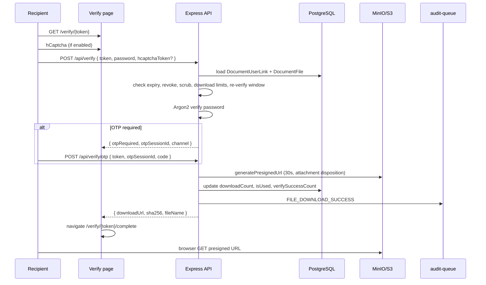
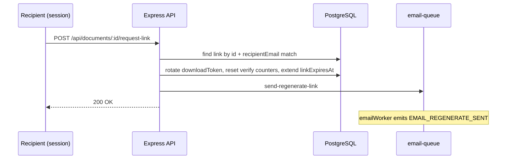

# Vellum

## Secure Document Transfer Platform

### Comprehensive Design Document

#### Version 2.1 — June 2026 (reviewed against codebase)

> **Purpose of this document:** This document describes the **current** Vellum system in enough detail that an engineering team could recreate it from scratch — architecture, data model, security model, API surface, background processing, configuration, and operational behavior. It supersedes Version 1.0 (May 2026), which described the original monolithic `Document` model before the feature roadmap (items 1–11) shipped.
>
> **Companion docs:** [USAGE.md](./USAGE.md) (operator guide), [CONFIG.md](./CONFIG.md) (environment variables), [EVENTS_AND_WEBHOOKS.md](./EVENTS_AND_WEBHOOKS.md) (audit + webhooks), [SFTP_INGESTION.md](./SFTP_INGESTION.md), [ERROR_HANDLING.md](./ERROR_HANDLING.md).

---

## How to read this document

This document serves **two audiences**. You do not need to read every section — use the guide below.

| If you are… | Start here | Technical sections (optional) |
|-------------|------------|--------------------------------|
| **Executive / product owner** | [Executive summary](#executive-summary), [§1 Overview](#1-project-overview), [§2 Personas](#2-personas-and-roles), [§7 Security (plain language)](#71-two-key-and-optional-third-key-access-model) | Skip API and schema details |
| **Compliance / audit** | [§16 Audit & webhooks](#16-audit-compliance-and-webhooks), [Appendix A](#appendix-a-audit-event-catalog), [§8 Lifecycle](#8-document-lifecycle) | Export API in §9.6 |
| **Operator / support** | [USAGE.md](./USAGE.md) first, then [§18 Admin tools](#18-admin-and-development-tools), [§5 Infrastructure](#5-infrastructure-and-deployment) | Compose ports table |
| **Integrator / developer** | Full document; prioritize [§9 API](#9-api-design), [§6 Data model](#6-data-model), [§14 Workers](#14-background-job-processing) | [§24 Recreation checklist](#24-recreation-checklist) |

**Format convention:** Sections marked with a **Plain language** block explain the same topic in everyday terms. Technical tables, code, and diagrams follow for implementers. Both are intentional — neither replaces the other.

---

## Executive summary

Vellum lets organizations **send sensitive files to specific people by email** without exposing the file in the email itself. Instead, the recipient gets a secure link and must also know a **separate password** (like a PIN) that the sender shares by phone or SMS. Optional extra checks (a one-time code or captcha) can be turned on for higher-risk scenarios.

**Why it exists:** Regulated industries need proof of who received what, when, and whether access succeeded or failed — often for years after the event. Vellum stores that proof even after the file itself is automatically deleted.

**How it works in one paragraph:** A backend system uploads a file through an API (or drops it on SFTP). Vellum scans for viruses, stores the file securely, and emails the recipient a link. The recipient opens the link, enters the password (and optional code), and downloads the file through a short-lived secure URL. Administrators can browse records, export audit logs, and connect webhooks so their own systems are notified of every important event.

**What changed in v2.0 (product):** One file can go to many recipients without duplicating storage; downloads can be limited and retried within a grace window; links can be revoked instantly; integrators receive signed webhook notifications; partners can upload via SFTP; recipients see a checksum to verify file integrity.

**Document v2.1** adds dual-audience plain-language sections and has been cross-checked against the current codebase (no further product features beyond v2.0).

---

## Glossary (non-technical)

| Term | Meaning |
|------|---------|
| **Integrator** | The organization's backend system that uploads files to Vellum (not the human recipient). |
| **Recipient** | The person who receives the email link and downloads the file. |
| **Administrator** | Internal staff who can view records, export audits, and use operator tools — without automatic access to file contents. |
| **Verify link** | The URL in the email; it proves that the recipient has the message. It expires after a configured time. |
| **File password** | A secret chosen at upload time; the recipient must be told it separately. Vellum never sends it by email. |
| **OTP / verification code** | Optional one-time code (email, text, WhatsApp, or authenticator app) after the password. |
| **Presigned URL** | A temporary direct download link (30 seconds) to storage; the app server never holds the file bytes. |
| **Audit log** | An immutable record of an action (login, download, email sent, revocation, etc.) kept for compliance. |
| **Webhook** | An automatic HTTP notification from Vellum to the integrator's system when an audit event occurs. |
| **TTL (time to live)** | How long something lasts before expiry — separately configurable for the link, the stored file, and database records. |
| **Scrub / purge** | Automatic deletion of expired files from storage (scrub) or old rows from the database (purge). |
| **SHA-256 checksum** | A fingerprint of the file contents; it lets the recipient confirm the download was not corrupted or swapped. |
| **White-label** | Custom branding (logo, colors, email wording) so Vellum appears as the client's product. |

---

## Table of Contents

0. [How to read this document](#how-to-read-this-document)
0. [Executive summary](#executive-summary)
0. [Glossary](#glossary-non-technical)
1. [Project Overview](#1-project-overview)
2. [Personas and Roles](#2-personas-and-roles)
3. [Technology Stack](#3-technology-stack)
4. [System Architecture](#4-system-architecture)
5. [Infrastructure and Deployment](#5-infrastructure-and-deployment)
6. [Data Model](#6-data-model)
7. [Security Architecture](#7-security-architecture)
8. [Document Lifecycle](#8-document-lifecycle)
9. [API Design](#9-api-design)
10. [Authentication and Authorization](#10-authentication-and-authorization)
11. [Frontend Application](#11-frontend-application)
12. [Email and White-Label Branding](#12-email-and-white-label-branding)
13. [Recipient OTP and hCaptcha](#13-recipient-otp-and-hcaptcha)
14. [Background Job Processing](#14-background-job-processing)
15. [SFTP Ingestion](#15-sftp-ingestion)
16. [Audit, Compliance, and Webhooks](#16-audit-compliance-and-webhooks)
17. [Error Handling and Compensation](#17-error-handling-and-compensation)
18. [Admin and Development Tools](#18-admin-and-development-tools)
19. [Configuration Reference](#19-configuration-reference)
20. [Testing Strategy](#20-testing-strategy)
21. [Source Layout](#21-source-layout)
22. [AWS Production Migration](#22-aws-production-migration)
23. [Future Work (Out of Scope for Current Release)](#23-future-work-out-of-scope-for-current-release)
24. [Recreation Checklist](#24-recreation-checklist)
25. [Appendix A: Audit Event Catalog](#appendix-a-audit-event-catalog)
26. [Appendix B: Evolution from v1.0](#appendix-b-evolution-from-v10)
27. [Appendix C: FAQ (non-technical)](#appendix-c-frequently-asked-questions-non-technical)
28. [Appendix D: Document maintenance](#appendix-d-document-maintenance)

---

## 1. Project Overview

### 1.1 Purpose

Vellum is a secure, **API-first** document transfer platform for regulated industries. An authorized integrator uploads a file on behalf of a sender; Vellum virus-scans it, stores it in object storage, and emails the recipient a time-limited verify link. The recipient must also know a **file password** communicated out-of-band. Even authenticated dashboard users must complete the verify flow to download — the dashboard only helps regenerate links.

> **Plain language:** Think of Vellum as a **secure courier for digital documents**. Your company's system drops off a package (the file); Vellum checks it for malware, locks it in a vault, and emails the recipient directions (the link). Opening the email is not enough — they also need a password you give them separately. The vault eventually destroys the package on schedule, but keeps a receipt (audit log) for regulators.

### 1.2 Name and Positioning

**Vellum** — named after parchment used for legal and financial records. Institution-neutral branding makes it suitable for banks, insurers, universities, and fax-to-email services.

### 1.3 Core Value Proposition

| Capability | Description |
|------------|-------------|
| **API-first** | Machine upload via Bearer API key; optional SFTP MFT drop |
| **Two-key download** | Possession (email link token) + knowledge (file password) on every download |
| **Optional third factor** | Recipient OTP (email, SMS, WhatsApp, or TOTP authenticator) after password |
| **Self-cleaning vault** | Files scrubbed from object storage on TTL; audit rows retained for compliance |
| **Multi-tier lifecycle** | Independent TTLs for verify link, object storage, and database record |
| **Download limits** | Configurable `maxDownloads` per recipient link (default 1) |
| **Integrity proof** | SHA-256 checksum shown to recipient after successful verify |
| **Full audit trail** | Every login, email, download, revocation, SFTP step, and OTP event logged |
| **Outbound webhooks** | Per-event HTTP POST with HMAC signature for integrator SIEM/automation |
| **White-label** | Brand presets for SPA shell, HTML emails, SMS/WhatsApp OTP copy |

### 1.4 Target Industries

Banking and finance (SOX), insurance, fax-to-email, and universities — any environment that requires provable document delivery with retention and audit.

### 1.5 Typical journey (non-technical)

| Step | Who | What happens |
|------|-----|--------------|
| 1 | Integrator | Uploads `report.pdf` for `customer@bank.com` with a password and expiry times |
| 2 | Vellum | Scans for viruses, stores file, emails customer a branded link (not the password) |
| 3 | Sender | Calls or texts customer with the file password |
| 4 | Customer | Clicks link, completes captcha/OTP if enabled, enters password, downloads file |
| 5 | Vellum | Records success in audit log; optional webhook notifies integrator's SIEM |
| 6 | Vellum (later) | Deletes file from storage on schedule; keeps audit rows for years |

---

## 2. Personas and Roles

> **Plain language:** Three types of people/systems interact with Vellum. **Integrators** are machines that send files. **Recipients** are customers or staff who receive them. **Administrators** are your internal team who monitor and export records — they cannot bypass the password step to download someone else's file.

| Persona | Typical user | Primary surfaces | Auth mechanism |
|---------|--------------|------------------|----------------|
| **Integrator** | Backend system, MFT job, scripts | `POST /api/upload`, `POST /api/upload/batch`, `POST /api/documents/:id/revoke` | `Authorization: Bearer <API_KEY>` |
| **Recipient** | Person receiving a document | Email link → `/verify/{token}`, optional `/dashboard` | None for verify; session cookie for dashboard |
| **Administrator** | Operator, compliance, engineering | `/admin`, `/docs/`, audit export, dev tools; **Revoke link** on `/admin/documents/:id` | Session cookie + `UserKind.ADMIN` |

Dashboard users are stored in Postgres (`users` table) with `kind` of `ADMIN` or `CONSUMER`. Admins are assigned on first sign-in when their email appears in `DEFAULT_ADMIN_EMAILS`. **Revocation** is available to integrators (API key) and admins (session cookie or admin UI button); see §7.5.

---

## 3. Technology Stack

| Layer | Technology | Purpose |
|-------|------------|---------|
| **Runtime** | Node.js 24+ / TypeScript (ESM) | API server and workers |
| **Frontend** | Vite + React 19 + TanStack Router + shadcn/ui + Tailwind | SPA dashboard, verify flow, admin UI |
| **Database** | PostgreSQL 15 + Prisma ORM | Metadata, users, audit, webhook delivery log |
| **Object storage** | MinIO (dev) / AWS S3 (prod) | Document bytes; presigned downloads |
| **Job queue** | BullMQ + Redis | Email, audit, webhook, scrub, reconciliation |
| **Virus scanning** | ClamAV (INSTREAM) | Malware detection before storage |
| **Authentication** | WorkOS AuthKit (prod) / dev mock | Dashboard SSO |
| **Email (dev)** | Mailpit + Nodemailer | Local SMTP + HTML preview |
| **Email (prod)** | AWS SES + Nodemailer | Production delivery |
| **SMS/WhatsApp OTP** | Twilio | Optional recipient OTP channels |
| **Captcha** | hCaptcha | Optional gate before password submit |
| **SFTP** | atmoz/sftp (Compose) | Legacy MFT partner drop |
| **Validation** | Zod | API input validation |
| **Password hashing** | Argon2 | File password hashing (`passwordHash` on links) |
| **Session** | HS256 JWT in HTTP-only cookie | Dashboard session (`vellum_session`) |
| **API errors** | RFC 9457 Problem Details | Uniform error responses |
| **Orchestration** | Docker Compose / Podman Compose | Multi-container stack |
| **Reverse proxy** | Nginx | Unified entry on :8080 in dev compose |
| **API docs** | TypeDoc → static HTML | Admin-only `/docs/` |
| **HTTP testing** | Bruno collections | Smoke and integration API tests |
| **E2E** | Puppeteer + Vitest | Browser and unit tests |

---

## 4. System Architecture

> **Plain language:** Vellum runs as several cooperating services in containers — a web interface, an API, background workers, a database, file storage, email, and a virus scanner. The diagram below is for engineers; the [Typical journey (§1.5)](#15-typical-journey-non-technical) describes the same flow in business terms.

### 4.1 Container Topology (Development Compose)

```text
                         ┌─────────────────────────────────────┐
                         │  nginx (:8080) — unified entry      │
                         └──────────────┬──────────────────────┘
                                        │
              ┌─────────────────────────┼─────────────────────────┐
              │                         │                         │
     ┌────────▼────────┐      ┌─────────▼─────────┐     ┌───────▼────────┐
     │  web (:5174)    │      │  app (:5173)      │     │  worker        │
     │  Vite dev SPA   │      │  Express API      │     │  BullMQ + SFTP │
     └─────────────────┘      └─────────┬─────────┘     └───────┬────────┘
                                        │                       │
     ┌──────────────┐  ┌────────────────┼───────────┐  ┌────────┴────────┐
     │  PostgreSQL  │  │     Redis      │  MinIO    │  ClamAV           │
     │  + Studio    │  │   (BullMQ)     │  (:9000)  │  (virus scan)     │
     │  + Adminer   │  └────────────────┘           └───────────────────┘
     └──────────────┘
     ┌──────────────┐  ┌────────────────┐  ┌─────────────────────────────┐
     │  Mailpit     │  │  sftp (:2222)  │  │  webhook-tester (:8090)    │
     │  (:8025 UI)  │  │  partner drop  │  │  dev webhook capture        │
     └──────────────┘  └────────────────┘  └─────────────────────────────┘
```

**Process separation:**

| Process | Entry file | Command | Role |
|---------|------------|---------|------|
| API (dev) | `src/api-server.ts` | `npm run dev:api` | Express on :5173, no Vite |
| SPA (dev) | Vite | `npm run dev` | React on :5174, proxies API |
| API (prod) | `src/server.ts` | production CMD | Express on `PORT`, serves `dist/` |
| Workers | `src/server/workers/index.ts` | `npm run worker` | All BullMQ consumers + SFTP watcher |

Both API entrypoints import `createApp()` from `src/server/create-app.ts`.

### 4.2 Logical Component Diagram

```text
┌─────────────────────────────────────────────────────────────────────────┐
│                           Client Layer                                   │
│  Integrator (curl/Bruno) │ Recipient browser │ Admin browser            │
└────────────┬─────────────────────────┬──────────────────┬─────────────────┘
             │                         │                  │
             ▼                         ▼                  ▼
┌────────────────────────────────────────────────────────────────────────┐
│  Express API (create-app.ts)                                            │
│  Routes: upload, verify, documents, revoke, admin, auth, health, meta  │
│  Middleware: apiKeyAuth, integratorOrAdminAuth, dashboardAuth, adminAuth, errorHandler │
└─────┬──────────────────┬─────────────────────┬──────────────────────────┘
      │                  │                     │
      ▼                  ▼                     ▼
┌───────────┐    ┌───────────────┐    ┌─────────────────────────────────┐
│  Prisma   │    │  S3/MinIO     │    │  BullMQ Queues                   │
│  Postgres │    │  presign/put  │    │  email, audit, webhook, cleanup  │
└───────────┘    └───────────────┘    └──────────────┬──────────────────┘
                                                      │
                                                      ▼
                                            ┌─────────────────┐
                                            │  Workers         │
                                            │  email, audit,   │
                                            │  webhook, scrub, │
                                            │  process-error,  │
                                            │  orphan-reconcile│
                                            └─────────────────┘
```

### 4.3 End-to-End Upload Flow (HTTP API)

```mermaid
sequenceDiagram
  participant I as Integrator
  participant API as Express API
  participant AV as ClamAV
  participant S3 as MinIO/S3
  participant DB as PostgreSQL
  participant Q as email-queue
  participant W as emailWorker
  participant M as Mailpit/SES

  I->>API: POST /api/upload (Bearer + multipart)
  API->>API: Zod validate fields; compute sha256
  API->>DB: find DocumentFile by sha256
  alt New unique bytes (no dedup hit)
    API->>AV: INSTREAM scan buffer
    AV-->>API: clean
    API->>DB: create DocumentFile row
    API->>S3: PutObject; set s3Key
  else Existing DocumentFile with s3Key
    Note over API: Skip scan + upload; reuse file row
  end
  API->>DB: create DocumentUserLink (token, passwordHash, TTLs)
  API->>Q: enqueue send-initial-link
  API-->>I: 201 { id, fileId, sha256, maxDownloads, warning }
  Q->>W: process job
  W->>M: multipart email (plain + HTML)
  W->>Q: audit-queue (EMAIL_INITIAL_SENT)
```

**Password rule:** The upload response includes an explicit warning: the file password must be delivered to the recipient **outside** Vellum (for example, by SMS, phone, or a separate email). Vellum never emails the password.

### 4.4 End-to-End Download Flow (Verify)



File bytes **never** pass through Node.js — only a short-lived presigned URL is returned.

### 4.5 Dashboard Regenerate Link Flow



Regenerating a link does **not** bypass password or OTP — it only sends a fresh token.

### 4.6 Express Middleware and Route Mount Order

Order matters for auth precedence (from `create-app.ts`):

```text
trust proxy → helmet → cors → cookieParser → json → requestId
/api/health, /api/meta                    (public)
/api/upload                             apiKeyAuth
/api/verify                             (public, rate-limited)
/api/documents/:id/revoke               integratorOrAdminAuth  (before dashboard)
/api/documents                          dashboardAuth
/api/admin                              adminAuth
/api/studio                             adminAuth
/api/dev                                adminAuth (non-prod webhook API)
/api/auth                               (mixed)
/docs/                                  adminAuth (via mountApiDocs)
production: static dist + SPA fallback
notFoundHandler → errorHandler
```

Revoke is mounted **before** dashboard auth on the same `/api/documents` prefix so integrators can call it with only a Bearer token.

---

## 5. Infrastructure and Deployment

### 5.1 Docker Compose Services

See `docker-compose.yml`. Key services:

| Service | Image / build | Ports | Notes |
|---------|---------------|-------|-------|
| `app` | `{VELLUM_PROJECT}-app:{VELLUM_ENV}` | 5173 | API; healthcheck on `/api/health` |
| `web` | same as app | 5174 | Vite dev UI |
| `worker` | `{VELLUM_PROJECT}-worker:{VELLUM_ENV}` | — | BullMQ + SFTP watcher |
| `nginx` | nginx:alpine | 8080 | Proxies web + app |
| `postgres` | custom Dockerfile | 5432, 5555, 8081 | DB + Prisma Studio + Adminer |
| `redis` | redis:alpine | 6379 | AOF persistence |
| `minio` | minio/minio | 9000, 9001 | S3-compatible storage |
| `clamav` | clamav/clamav | — | Health gate for app/worker |
| `mailpit` | axllent/mailpit | 8025, 1025 | Dev SMTP + UI |
| `sftp` | atmoz/sftp:alpine | 2222 | Partner file drop |
| `webhook-tester` | ghcr.io/tarampampam/webhook-tester | 8090 | Dev webhook capture |

Image tags and OCI labels use `VELLUM_PROJECT` and `VELLUM_ENV` (see [CONFIG.md](./CONFIG.md)).

### 5.2 Startup and Migrations

`npm run up` builds and starts the stack. The app container entrypoint runs `prisma migrate deploy` on startup (see `scripts/docker-entrypoint.sh`) and retries until the database accepts connections. On first boot, allow 2–5 minutes for ClamAV to become ready.

> **Plain language:** Starting the stack also updates the database schema automatically. On first boot, wait a few minutes for the virus scanner to become ready before testing uploads.

### 5.3 Production vs Development

| Aspect | Development | Production |
|--------|-------------|------------|
| `NODE_ENV` | `development` | `production` |
| SPA | Vite dev server (`web` container) | Static files from `dist/` served by Express |
| Auth | `AUTH_PROVIDER=dev` mock login | WorkOS AuthKit |
| Email | Mailpit | AWS SES |
| Storage | MinIO | AWS S3 |
| Captcha/OTP bypass flags | `SKIP_CAPTCHA`, `SKIP_VIRUS_SCAN`, `SKIP_EMAIL_VERIFICATION` allowed | Ignored |

### 5.4 Public URL Derivation

Email links and OAuth callbacks use `APP_URL` or derive from `VELLUM_HOST`, `VELLUM_PUBLIC_SCHEME`, and `VELLUM_PUBLIC_PORT`. Presigned download URLs use `MINIO_PUBLIC_ENDPOINT` (browser-reachable), which defaults to `http://{VELLUM_HOST}:9000` when the internal endpoint is `minio`.

---

## 6. Data Model

### 6.1 Design Principle: File / Link Split

As of version 2.0, Vellum separates **shared file assets** from **per-recipient download links** (document version 2.1 describes that model):

| Model | Table | Represents |
|-------|-------|--------------|
| `DocumentFile` | `document_files` | One stored object (deduplicated by SHA-256) |
| `DocumentUserLink` | `document_user_links` | One recipient's token, password, limits, OTP config |

This enables batch upload (one file, many recipients) and SHA-256 deduplication without duplicating S3 objects.

> **Plain language:** The **file** is the document in the vault (stored once). Each **link** is a separate envelope to a different recipient — each with their own password, expiry, and download limits — pointing at the same vault object when the content is identical.

### 6.2 Entity Relationship

```text
DocumentFile 1 ──< * DocumentUserLink
DocumentUserLink 1 ──< * AuditLog  (via documentId → link id, legacy column name)

User (standalone)
AuditLog (optional userId, optional documentId)
ProcessError (standalone, cross-linked to audit failures)
WebhookDelivery → auditLogId (no FK, string reference)
FailedAuditLog / FailedProcessError / FailedWebhookDelivery (dead letters)
```

### 6.3 DocumentFile

| Field | Type | Description |
|-------|------|-------------|
| `id` | UUID | Primary key |
| `sha256` | String @unique | SHA-256 hex (64 chars) — dedup key |
| `s3Key` | String? | Object key; `null` after scrub |
| `fileName` | String | Original filename (sanitized) |
| `fileExpiresAt` | DateTime | When object may be deleted from storage |
| `recordExpiresAt` | DateTime | When DB row may be purged (`REPORTING_LIFETIME_YEARS`) |
| `deletedAt` | DateTime? | Set when scrubbed |
| `byteSize` | Int? | File size in bytes |
| `createdAt` | DateTime | Insert time |

**Dedup behavior:** On upload, compute SHA-256. If a row exists with a matching hash and a non-null `s3Key`, reuse it (extend `fileExpiresAt` if the new request is longer). Skip virus scan and S3 upload for deduplicated bytes.

### 6.4 DocumentUserLink

| Field | Type | Description |
|-------|------|-------------|
| `id` | UUID | Primary key; API "document id" for integrators |
| `documentFileId` | UUID FK | Shared file reference |
| `recipientEmail` | String | Recipient inbox for download link |
| `passwordHash` | String | Argon2 hash of file password |
| `downloadToken` | String @unique | Opaque token in verify URL |
| `linkExpiresAt` | DateTime | When verify link stops working |
| `maxDownloads` | Int default 1 | Successful download cap |
| `downloadCount` | Int default 0 | Consumptions used |
| `verifySuccessCount` | Int default 0 | Re-verify attempts in current window |
| `lastVerifiedAt` | DateTime? | Start of current re-verify window |
| `isUsed` | Boolean default false | Fully consumed (all downloads + re-verify exhausted) |
| `revokedAt` | DateTime? | Manual revocation timestamp |
| `otpChannel` | RecipientOtpChannel? | Optional second factor channel |
| `recipientPhone` | String? | E.164 for SMS/WhatsApp OTP |
| `totpSecretEnc` | String? | AES-256-GCM encrypted TOTP secret |
| `batchId` | String? | Groups batch upload links |
| `createdAt` | DateTime | Insert time |

**Legacy note:** `AuditLog.documentId` stores the **link** id (`DocumentUserLink.id`), not the file id, for API backward compatibility.

### 6.5 User

| Field | Description |
|-------|-------------|
| `id` | WorkOS user id or `dev:{email}` |
| `email` | Unique, normalized lowercase |
| `emailVerified` | Required before dashboard sign-in (except admins) |
| `kind` | `ADMIN` or `CONSUMER` |
| `firstName`, `lastName`, `profilePictureUrl` | From WorkOS profile |
| `lastSignInAt` | Updated on login |

### 6.6 AuditLog

Immutable compliance events. See [Appendix A](#appendix-a-audit-event-catalog).

| Field | Description |
|-------|-------------|
| `eventType` | `AuditEventType` enum |
| `timestamp` | UTC insert time |
| `userId` | Dashboard user when applicable |
| `documentId` | Link id when applicable |
| `ipAddress`, `userAgent` | HTTP context |
| `metadata` | JSON event-specific payload |
| `expiresAt` | Retention horizon |
| `processErrorId` | Cross-link to operational error |

### 6.7 WebhookDelivery

One row per HTTP delivery attempt:

| Field | Description |
|-------|-------------|
| `deliveryId` | UUID; matches `X-Vellum-Delivery-Id` header |
| `auditLogId` | Source audit row |
| `eventType`, `targetUrl`, `payload` | Delivery context |
| `responseStatus`, `responseBody` | Truncated target response |
| `success`, `attempt` | Outcome and retry count |

### 6.8 ProcessError and Dead Letters

Operational failures (HTTP 4xx/5xx, worker crashes) persist to `ProcessError` via the process-error queue. Failed queue writes go to `FailedAuditLog`, `FailedProcessError`, or `FailedWebhookDelivery`. Cross-table linking uses `correlationId`, `processErrorId`, and `failedAuditLogId` — see [ERROR_HANDLING.md](./ERROR_HANDLING.md).

### 6.9 Prisma Migrations (Current)

| Migration | Scope |
|-----------|-------|
| `20260602160000_init` | Initial schema |
| `20260607120000_roadmap_items_1_4` | Download limits, revocation, audit export fields, re-verify columns |
| `20260607140000_roadmap_items_5_10` | OTP fields, captcha audit enum, recipient OTP channel |
| `20260608140000_batch_upload_document_split` | `DocumentFile` + `DocumentUserLink` split |
| `20260609120000_sftp_ingestion_audit_events` | SFTP audit enum values |
| `20260609180000_webhook_delivery` | `WebhookDelivery`, `FailedWebhookDelivery` |

---

## 7. Security Architecture

> **Plain language:** Security is layered. Upload requires a secret API key. Download requires the email link **and** the file password (and optionally a one-time code). Files are scanned for malware before storage. Download URLs expire in 30 seconds. Failed attempts are logged. Administrators cannot silently read files — they see metadata and audit trails only.

### 7.1 Two-Key (and Optional Third-Key) Access Model

| Factor | Mechanism | Storage |
|--------|-----------|---------|
| **Possession** | Verify URL contains `downloadToken` | `DocumentUserLink.downloadToken` |
| **Knowledge** | File password entered on verify page | Argon2 hash in `passwordHash` |
| **Optional OTP** | Code after password when `RECIPIENT_OTP_ENABLED` **and** the link has `otpChannel` set at upload | Redis session + channel-specific delivery |

Dashboard session cookies do **not** grant file access. Admins use the same verify flow unless testing via API.

| Factor | Plain-language analogy |
|--------|------------------------|
| **Possession** | Having the emailed invitation |
| **Knowledge** | Knowing the PIN/password the sender told you separately |
| **Optional OTP** | A code sent by text or generated by an authenticator app |

### 7.2 Upload Security

1. **API key** required on `POST /api/upload` and `/api/upload/batch`.
2. **Zod validation** on all multipart fields.
3. **Extension allowlist** via `ALLOWED_UPLOAD_EXTENSIONS`; misleading double extensions stripped.
4. **Size limit** via `MAX_UPLOAD_BYTES` (default 50 MiB; the entire file is buffered in memory via Multer).
5. **ClamAV INSTREAM scan** before first storage of unique bytes (skippable in dev via `SKIP_VIRUS_SCAN`).
6. **Argon2** hashing of file passwords; plaintext never persisted.
7. **Compensation stack** on upload — failed steps undo the S3 put and database rows that were created in that request.

### 7.3 Download Security

1. No file bytes through Node.js — **30-second presigned URL** only.
2. `Content-Disposition: attachment` forces download.
3. **hCaptcha** before password submit when `CAPTCHA_PROVIDER=hcaptcha`.
4. **Download limits** — reject when `downloadCount >= maxDownloads`.
5. **Re-verify window** — after the first successful verify, the recipient may retry requesting a presigned URL within the window before final consumption (see §8.3).
6. All verify outcomes audited (`FILE_DOWNLOAD_SUCCESS` or `FILE_DOWNLOAD_FAILED` with `metadata.reason`).
7. **Rate limiting:** verify password — 5 attempts per 15 minutes per token or IP; OTP — 10 attempts per 15 minutes per session/token/IP (`express-rate-limit` in `verify.ts`).

### 7.4 Presigned URL Policy

- **Expiry:** 30 seconds (`expiresIn: 30` in `generatePresignedUrl`).
- **Client:** Separate S3 client using `MINIO_PUBLIC_ENDPOINT` so browser can reach MinIO/S3.
- **Disposition:** `attachment; filename="{fileName}"` to force download.

### 7.5 Revocation

`POST /api/documents/:id/revoke` sets `linkExpiresAt = now`, `revokedAt = now`, `isUsed = true`. Shared `DocumentFile` is **not** deleted — other recipient links may still reference it. Emits `LINK_REVOKED`. Implemented in `src/lib/revoke-document.ts`; mounted before dashboard auth so API key callers can revoke without session.

### 7.6 Webhook Security

Vellum signs the raw JSON body with HMAC-SHA256 in `X-Vellum-Signature: sha256={hex}` using `WEBHOOK_SECRET`. Integrators must verify the signature before trusting the payload.

### 7.7 Session Security

`vellum_session` cookie: HTTP-only, HS256 JWT signed with `SESSION_SECRET` (32+ chars in production), 7-day TTL.

---

## 8. Document Lifecycle

> **Plain language:** Every document has three independent clocks: (1) how long the **email link** works, (2) how long the **file** stays in storage, and (3) how long **records** are kept for auditors. When the file clock runs out, the bytes are deleted but the audit history remains until the record clock runs out (typically five years).

### 8.1 Three-Tier TTL

| Tier | Field | Meaning |
|------|-------|---------|
| **Link** | `DocumentUserLink.linkExpiresAt` | Verify URL validity |
| **File** | `DocumentFile.fileExpiresAt` | Object storage retention |
| **Record** | `DocumentFile.recordExpiresAt` | Database row retention (default +5 years from upload) |

Constraint: `linkTtl ≤ fileTtl` at upload time. Link TTL is always set **per upload** via the `linkTtl` field (seconds) — there is no global default read from environment at runtime.

| Tier | Plain-language question it answers |
|------|-----------------------------------|
| **Link** | "How long can the recipient use the email link?" |
| **File** | "How long do we keep the actual file in storage?" |
| **Record** | "How long do we keep the paper trail in the database?" |

### 8.2 Upload Paths

| Path | Trigger | Module |
|------|---------|--------|
| HTTP single | `POST /api/upload` | `src/server/routes/upload.ts` |
| HTTP batch | `POST /api/upload/batch` | same + `parseBatchRecipients` |
| SFTP drop | Worker inbox poll | `src/server/sftp/` |

All paths call `ingestDocumentFile()` then `createDocumentUserLink()`.

**`createDocumentUserLink()` steps:**

1. Resolve `maxDownloads` (field or `DEFAULT_MAX_DOWNLOADS`).
2. If `RECIPIENT_OTP_ENABLED`, persist `otpChannel`; generate encrypted TOTP secret + provisioning URI for `authenticator`.
3. Hash password with Argon2; generate 32-byte hex `downloadToken`.
4. Insert `DocumentUserLink` with `linkExpiresAt = now + linkTtl`.
5. Enqueue `send-initial-link` on email-queue.
6. Register compensation undo (delete link row on downstream failure).

### 8.3 Download Consumption and Re-Verify Window

Implemented in `src/lib/verify-consumption.ts`:

1. Before password check, reject if `downloadCount >= maxDownloads` (`download_limit_reached`).
2. If `isUsed` and outside re-verify window or max re-verify attempts exceeded → `link_consumed`.
3. On successful verify, increment `verifySuccessCount` within window.
4. When `verifySuccessCount` reaches `maxReverifyAttempts` (env), increment `downloadCount` and possibly set `isUsed = true` if all downloads consumed.
5. Reset `verifySuccessCount` when a consumption completes but downloads remain.

This **softens the one-time-download experience**: the recipient can retry the download if the browser fails within the grace window before the link is fully consumed.

**Configuration:**

| Variable | Default | Meaning |
|----------|---------|---------|
| `REVERIFY_WINDOW_MS` | `300000` (5 min) | Duration of a re-verify window after the first successful verify in a consumption cycle |
| `MAX_REVERIFY_ATTEMPTS` | `3` | Successful verifies allowed within one window before one `downloadCount` increment |

**Example (`maxDownloads=1`, defaults):** The recipient verifies the password → receives a presigned URL → the browser fails to download → they may re-enter the password up to 3 times within 5 minutes → on the 3rd success, `downloadCount` becomes 1 and `isUsed` becomes true (unless more downloads are allowed).

**Implementation reference:** `getVerifyRejection()` and `computeVerifyConsumptionUpdate()` in `src/lib/verify-consumption.ts`; applied in `completeDownload()` after Argon2 and optional OTP succeed.

### 8.4 Scrub Workers

| Worker | Schedule | Action |
|--------|----------|--------|
| `fileScrubWorker` | Hourly cron | Null `DocumentFile.s3Key`, delete S3 object, emit `FILE_SCRUBBED` |
| `recordScrubWorker` | Monthly cron | Purge expired `DocumentFile`, links, and audit rows past `expiresAt` |

File scrub: DB update first, then S3 delete (compensation restores DB on S3 failure).

### 8.5 SHA-256 Integrity

Computed at ingest (`computeSha256`). Returned on successful verify and shown on `/verify/{token}/complete` via the `FileSha256Display` component. The recipient can compare locally with `sha256sum downloaded-file`.

---

## 9. API Design

> **Plain language:** The API is how other systems talk to Vellum — upload files, revoke links, and (for admins) export audit data. Recipients mostly use the **website** (verify page), not the API directly. Success responses use a consistent JSON envelope; errors use a standard format (Problem Details) that client apps can parse reliably.

### 9.1 Response Envelopes

| Type | Content-Type | Shape |
|------|--------------|-------|
| Success | `application/vnd.vellum.result+json` | `{ type, title, status, data, ... }` |
| Error | `application/problem+json` | RFC 9457 Problem Details |

See [ERROR_HANDLING.md](./ERROR_HANDLING.md).

### 9.2 Endpoint Catalog

| Method | Path | Auth | Purpose |
|--------|------|------|---------|
| `GET` | `/api/health` | None | DB, Redis, ClamAV status |
| `GET` | `/api/meta` | None | Public config (hCaptcha site key, feature flags) |
| `POST` | `/api/upload` | API key | Single-recipient upload |
| `POST` | `/api/upload/batch` | API key | Multi-recipient upload |
| `POST` | `/api/verify` | None | Password (+ captcha) → URL or OTP session |
| `POST` | `/api/verify/otp` | None | OTP code → presigned URL + sha256 |
| `POST` | `/api/verify/otp/resend` | None | Resend email/SMS/WhatsApp OTP |
| `GET` | `/api/documents` | Session | List links for recipient email |
| `POST` | `/api/documents/:id/request-link` | Session | Regenerate link email |
| `POST` | `/api/documents/:id/revoke` | API key or admin | Revoke link |
| `GET` | `/api/admin/*` | Admin session | Read-only table browser + audit export |
| `GET` | `/api/dev/webhook-deliveries` | Admin (non-prod) | Webhook inspector API |
| `GET` | `/api/auth/login` | None | WorkOS redirect |
| `GET` | `/api/auth/callback` | WorkOS | OAuth callback |
| `POST` | `/api/auth/dev/request-login` | None | Dev login email |
| `GET` | `/api/auth/verify-email` | Token | Dev email verification |
| `GET` | `/api/auth/me` | Session | Current user |
| `POST` | `/api/auth/logout` | Session | Clear cookie |
| `GET` | `/docs/` | Admin session | TypeDoc HTML |

### 9.3 Upload Request (Single)

**Multipart fields** (validated by `uploadFieldsSchema`):

| Field | Required | Notes |
|-------|----------|-------|
| `file` | Yes | Document bytes |
| `recipientEmail` | Yes | |
| `password` | Yes | Min 8 chars |
| `linkTtl` | Yes | Seconds |
| `fileTtl` | Yes | Seconds; must be ≥ linkTtl |
| `maxDownloads` | No | Default `DEFAULT_MAX_DOWNLOADS` (1) |
| `otpChannel` | No | `email`, `sms`, `whatsapp`, `authenticator` |
| `recipientPhone` | If sms/whatsapp | E.164 |

**Response (`201`):** `{ id, linkId, fileId, sha256, maxDownloads, otpChannel?, totpProvisioningUri?, warning }`

### 9.4 Upload Request (Batch)

| Field | Required | Notes |
|-------|----------|-------|
| `file` | Yes | Shared bytes |
| `recipients` | Yes | JSON array, max `MAX_BATCH_RECIPIENTS` (50) |

**Response (`201`):** `{ batchId, fileId, sha256, links: [{ id, recipientEmail }], warning }`

### 9.5 Verify Request

**POST /api/verify** body: `{ token, password, hcaptchaToken? }`

Failure reasons in audit `metadata.reason`: `invalid_token`, `revoked`, `file_scrubbed`, `expired_link`, `download_limit_reached`, `link_consumed`, `Incorrect password`, `rate_limited`, `captcha_failed`.

**POST /api/verify/otp** body: `{ token, otpSessionId, code }`

**POST /api/verify/otp/resend** body: `{ token, otpSessionId }`

### 9.6 Audit Export

**GET /api/admin/audit-logs** — admin session.

| Query | Purpose |
|-------|---------|
| `format=csv` or `Accept: text/csv` | CSV download |
| `limit` | Page size (max `AUDIT_EXPORT_MAX_LIMIT`) |
| `cursor` | Cursor pagination |
| `eventType`, `documentId`, `userId` | Filters (`documentId` = recipient **link** id) |
| `from`, `to` | ISO date range |
| `includeExpired` | Include rows past retention |

---

## 10. Authentication and Authorization

> **Plain language:** Three doors: (1) **API key** for machines uploading files, (2) **session cookie** for humans using the dashboard after login, (3) **admin role** for operator pages. The verify/download page is intentionally **public** (no login) — security comes from the link token and password, not from a user account.

### 10.1 Integrator (API Key)

Middleware: `apiKeyAuth` on `/api/upload/*`. Header: `Authorization: Bearer {API_KEY}`.

### 10.2 Dashboard Session

Middleware: `dashboardAuth` on `/api/documents/*` (except revoke).

Cookie `vellum_session` (HS256 JWT). Dev mode also accepts `X-Dev-User-Email` header for API calls (not full-page routes like `/docs/`).

### 10.3 Admin

Middleware: `adminAuth` on `/api/admin/*`, `/api/studio/*`, `/api/dev/*`. Requires `users.kind === ADMIN`.

Revoke accepts **either** API key or admin session via `integratorOrAdminAuth`.

### 10.4 WorkOS Flow

1. `GET /api/auth/login` → WorkOS AuthKit
2. Callback upserts user, checks `emailVerified`
3. Unverified non-admins → `/login/email-verification`
4. Sets session cookie, logs `USER_LOGIN`

### 10.5 Dev Auth Flow

1. `POST /api/auth/dev/request-login` with email
2. Mailpit link → `GET /api/auth/verify-email`
3. Return to `/login`, sign in → session cookie

---

## 11. Frontend Application

> **Plain language:** The website has separate areas: **login and dashboard** for recipients, **verify pages** for anyone with an email link (no account needed), and **admin** pages for internal staff. Status badges on the dashboard show at a glance whether a link is still valid and how many downloads remain.

### 11.1 Stack and Routing

- **TanStack Router** file-based routes under `src/routes/`
- Pages in `src/pages/`
- shadcn/ui components in `src/components/`

### 11.2 Key Routes

| Route | Audience | Purpose |
|-------|----------|---------|
| `/login`, `/login/email-verification` | All | Sign-in |
| `/dashboard` | Recipient | Document list, status badges, request link |
| `/verify/$token` | Public | Password + captcha + OTP entry |
| `/verify/$token/complete` | Public | Download + SHA-256 display |
| `/admin` | Admin | Table overview tiles |
| `/admin/document-files`, `/admin/documents` | Admin | File and link browsers; **revoke** on link detail |
| `/admin/audit-logs`, … | Admin | All DB tables read-only |
| `/admin/webhook-deliveries` | Admin | Webhook delivery log |
| `/dev/webhooks` | Admin (dev) | Native webhook inspector |
| `/docs/` | Admin | TypeDoc API reference |

### 11.3 Status Badges

`DocumentStatusBadges` shows whether the link is active, expired, or revoked; whether the file is available or scrubbed; and download usage (for example, "1 of 2 downloads used").

### 11.4 Data Tables

Admin list pages use shared `DataTable` with a column registry in `src/lib/data-table-db-schema.ts` — it maps Prisma models to filterable, sortable columns. Secrets (tokens, password hashes, and S3 keys) are excluded.

---

## 12. Email and White-Label Branding

> **Plain language:** Download-link emails can look like your organization's product — logo, colors, and wording — not a generic system message. Emails include both plain text (for accessibility) and HTML (for branding). The file password is **never** included in these emails by design.

### 12.1 Email Types

| Job | Template key | Trigger |
|-----|--------------|---------|
| `send-initial-link` | `email.templates.initialLink` | After upload / SFTP ingest |
| `send-regenerate-link` | `email.templates.regenerateLink` | Dashboard request-link |
| Dev verification | `email.templates.emailVerification` | Dev auth |
| Recipient OTP | `email.templates.recipientOtp` | Verify password step |

### 12.2 Multipart Delivery

Plain text + **branded HTML** via `render-html-email.ts`. HTML uses preset logo URL, primary color, footer from `src/lib/brand/presets.ts`.

### 12.3 Brand Presets

Build-time (`VITE_BRAND_PRESET`) and runtime (`BRAND_PRESET`) preset ids. Assets under `public/brands/{id}/`. SMS/WhatsApp OTP copy in `sms.templates.recipientOtp` and `whatsapp.templates.recipientOtp`.

---

## 13. Recipient OTP and hCaptcha

> **Plain language:** Optional extra steps after the file password: a **captcha** blocks automated guessing, and **OTP** sends a one-time code (by email, text, WhatsApp, or authenticator app). These are off by default and turned on via environment configuration when policy requires them.

### 13.1 OTP Channels

| Channel | Delivery | Notes |
|---------|----------|-------|
| `email` | Email worker | Same branded templates |
| `sms` | Twilio SMS | Requires `recipientPhone` |
| `whatsapp` | Twilio WhatsApp | Requires `recipientPhone` |
| `authenticator` | TOTP | Returns `totpProvisioningUri` at upload; secret encrypted in DB |

Master switch: `RECIPIENT_OTP_ENABLED`. A link must also have `otpChannel` set at upload (or in the SFTP manifest) for OTP to apply — both must be true (`isRecipientOtpRequired()` in code). Session state is stored in Redis with TTL `OTP_TTL_SECONDS`, max attempts `OTP_MAX_ATTEMPTS`, and max resends `OTP_MAX_RESENDS`.

### 13.2 hCaptcha

When `CAPTCHA_PROVIDER=hcaptcha`, the verify page loads the site key from `GET /api/meta`. The password submit request includes `hcaptchaToken` in the JSON body. The server verifies it via the hCaptcha siteverify API. Failures emit `CAPTCHA_FAILED`.

> **Plain language:** Captcha is an optional "prove you're human" checkbox before the password field — useful if bots are guessing passwords against public links.

Dev bypass: `SKIP_CAPTCHA=true` (non-production only).

---

## 14. Background Job Processing

> **Plain language:** Slow or non-critical work happens **in the background** so the API responds quickly. Sending email, writing audit rows, delivering webhooks, and deleting expired files are all queued jobs processed by separate worker processes — not during the user's HTTP request.

### 14.1 Queues

| Queue | Producer | Consumer | Purpose |
|-------|----------|----------|---------|
| `email-queue` | upload, documents, SFTP | `emailWorker` | Send emails |
| `audit-queue` | routes, workers | `auditWorker` | Persist audit + enqueue webhooks |
| `webhook-queue` | `auditWorker` | `webhookWorker` | HTTP POST to integrator URLs |
| `process-errors-queue` | `errorHandler`, workers | `processErrorWorker` | Persist ProcessError |
| `cleanup-queue` | cron schedulers | scrub/reconcile workers | Lifecycle maintenance |

### 14.2 Workers

| Worker | File | Role |
|--------|------|------|
| `emailWorker` | `emailWorker.ts` | Nodemailer send; audit email events |
| `auditWorker` | `auditWorker.ts` | Insert AuditLog; enqueue webhook jobs |
| `webhookWorker` | `webhookWorker.ts` | Signed POST; WebhookDelivery rows |
| `fileScrubWorker` | `fileScrubWorker.ts` | Delete expired S3 objects |
| `recordScrubWorker` | `recordScrubWorker.ts` | Purge expired DB rows |
| `processErrorWorker` | `processErrorWorker.ts` | ProcessError persistence + linking |
| `orphanReconciliationWorker` | `orphanReconciliationWorker.ts` | Optional daily orphan cleanup |

### 14.3 Cron Schedules (via cleanup-queue)

| Job | Pattern | Action |
|-----|---------|--------|
| `scrub-files` | `0 * * * *` (hourly) | File scrub |
| `scrub-records` | `0 0 1 * *` (monthly) | Record purge |
| `reconcile-orphans` | `ORPHAN_RECONCILE_CRON` | Optional orphan reconciliation |

---

## 15. SFTP Ingestion

> **Plain language:** For partners who cannot use the HTTP API, Vellum watches an SFTP folder (like a shared mailbox). They upload a file plus a small JSON "label" describing the recipient and password. The same virus scan, storage, email, and audit steps run automatically.

Partners drop `{filename}` plus a `{filename}{SFTP_MANIFEST_SUFFIX}` manifest (default: `{filename}.json`) into the SFTP inbox. The worker polls every `SFTP_POLL_INTERVAL_MS`, waits for a stable file size (`SFTP_STABLE_FILE_MS`), then runs the same ingest pipeline as HTTP upload.

### 15.1 Manifest Schema

```json
{
  "recipientEmail": "recipient@example.com",
  "password": "download-secret",
  "linkTtl": 86400,
  "fileTtl": 604800,
  "maxDownloads": 1,
  "otpChannel": "email"
}
```

### 15.2 Pipeline Audit Events

| Step | Event |
|------|-------|
| File detected | `SFTP_FILE_RECEIVED` |
| Manifest valid | `SFTP_METADATA_VALIDATED` |
| ClamAV clean | `SFTP_VIRUS_SCAN_PASSED` |
| S3 stored | `SFTP_STORAGE_UPLOADED` |
| Link created | `SFTP_DOCUMENT_CREATED` |
| Email queued | `SFTP_EMAIL_QUEUED` |
| Archived | `SFTP_INGESTION_COMPLETED` |
| Failure | `SFTP_INGESTION_FAILED` |

Success → `SFTP_ARCHIVE_PATH`; failure → `SFTP_FAILED_PATH` with `.error.json` sidecar.

See [SFTP_INGESTION.md](./SFTP_INGESTION.md).

---

## 16. Audit, Compliance, and Webhooks

> **Plain language:** Every important action leaves a **permanent journal entry** — who logged in, who downloaded, whether a password was wrong, when a link was revoked, each step of SFTP processing, etc. These entries can be **exported to CSV** for auditors or **pushed automatically** to your own systems via webhooks. The journal outlives the file itself.

### 16.1 Emit API

```typescript
logEvent({
  eventType: 'FILE_DOWNLOAD_SUCCESS',
  documentId: link.id,
  ip: req.ip,
  userAgent: req.headers['user-agent'],
  metadata: { downloadCount, maxDownloads, isFinalConsumption },
});
```

Enqueued to `audit-queue` — it never blocks the HTTP response on a DB write.

### 16.2 Webhook Pipeline

After `auditWorker` inserts a row, if `WEBHOOKS_ENABLED` and the matching `WEBHOOK_URL_{EVENT_TYPE}` is set, it enqueues a `webhook-queue` job.

> **Plain language:** Webhooks are **automatic phone calls** from Vellum to your system: "Hey, a download just succeeded" or "A link was revoked." Each event type can go to a different URL. Payloads are cryptographically signed so you can trust they came from Vellum.

**Headers:** `X-Vellum-Event-Type`, `X-Vellum-Delivery-Id`, `X-Vellum-Signature`

**Retries:** Up to `WEBHOOK_MAX_RETRIES`; final failure → `FailedWebhookDelivery`.

Full catalog: [EVENTS_AND_WEBHOOKS.md](./EVENTS_AND_WEBHOOKS.md).

### 16.3 Retention

`AuditLog.expiresAt` = now + `REPORTING_LIFETIME_YEARS`. Export API excludes expired rows unless `includeExpired=true`.

> **Plain language:** Audit records default to **five years** of retention (configurable). After that they can be purged by the monthly cleanup job — export before purge if your policy requires longer archival elsewhere.

### 16.4 Webhook Payload Shape

```json
{
  "deliveryId": "550e8400-e29b-41d4-a716-446655440000",
  "eventType": "FILE_DOWNLOAD_SUCCESS",
  "timestamp": "2026-06-07T12:00:00.000Z",
  "auditLogId": "a1b2c3d4-e5f6-7890-abcd-ef1234567890",
  "documentId": "link-uuid",
  "userId": null,
  "ipAddress": "203.0.113.10",
  "userAgent": "Mozilla/5.0 …",
  "metadata": {
    "downloadCount": 1,
    "maxDownloads": 1,
    "isFinalConsumption": true,
    "reverifyAttempt": 3
  }
}
```

Built by `buildWebhookPayload()`; signed over the **raw** JSON string body.

### 16.5 Planned Audit Events (Not Yet in Schema)

Documented for a future release — see [EVENTS_AND_WEBHOOKS.md](./EVENTS_AND_WEBHOOKS.md#planned-event-types). These event types are **not** in the Prisma enum today:

| Event | Intended trigger |
|-------|------------------|
| `DOCUMENT_UPLOADED` | Successful HTTP or SFTP upload committed |
| `UPLOAD_REJECTED` | Virus scan, validation, or extension rejection |
| `LINK_REGENERATION_REQUESTED` | Dashboard request-link before the email worker runs |
| `USER_EMAIL_VERIFIED` | Dev or WorkOS email verification consumed |

All SFTP and OTP events listed in [Appendix A](#appendix-a-audit-event-catalog) are already in the enum and are emitted when the corresponding action occurs.

---

## 17. Error Handling and Compensation

> **Plain language:** When something goes wrong, users see a clear, consistent error message (not a stack trace). The system also records the failure internally for support and compliance. Multi-step operations (like upload) **roll back** partial changes if a later step fails — so you never get a database record without a file, or vice versa.

### 17.1 AppError

Single operational error class with factories (`badRequest`, `unauthorized`, `notFound`, `gone`, `unprocessableContent`, `tooManyRequests`, etc.). Routes throw `AppError`; global `errorHandler` converts to Problem Details.

### 17.2 Triple-Write Pipeline

Every handled error:
1. NDJSON log in `{LOG_DIR}/process-errors.ndjson`
2. Enqueued to `process-errors-queue` → `ProcessError` table
3. Returned as Problem Details on HTTP

### 17.3 Compensation Stacks

Multi-step mutations use LIFO undo:

| Flow | Undo on failure |
|------|-----------------|
| Upload | LIFO undo of registered steps: new `DocumentUserLink` row; **if not deduped**, new `DocumentFile` row + S3 object |
| Request link | Revert token/expiry state |
| File scrub | Restore s3Key in DB |

Partial failure returns `compensationFailed` extension.

### 17.4 Audit ↔ Process-Error Correlation

The wrong-password verify flow demonstrates cross-pipeline linking:

1. Route generates `correlationId` (UUID).
2. `logEvent({ metadata: { correlationId, reason: 'Incorrect password' } })` enqueues audit.
3. `AppError.unauthorized` thrown; `errorHandler` calls `recordProcessError({ correlationId, documentId })`.
4. Whichever worker completes second links `AuditLog.processErrorId` ↔ `ProcessError.auditLogId` via shared `correlationId`.

This enables SIEM queries that join compliance events with operational error rows for the same incident.

---

## 18. Admin and Development Tools

> **Plain language:** Administrators get a **mostly read-only control panel** inside the web app — every database table as a searchable list, plus CSV export of audit logs. They see statuses and timestamps, not file contents or passwords. In development mode, extra shortcuts (an email inbox viewer, a storage console, and a webhook debugger) appear in the sidebar.

### 18.1 Admin Data Browser

Read-only paginated lists for every Postgres table. Detail pages exist for document files and document links. The only mutating admin UI action is **Revoke link** on `/admin/documents/:id` (which calls `POST /api/documents/:id/revoke` with an admin session). Revocation invalidates the link only — shared storage is retained when other links reference the same file (§7.5). *Note:* The confirm dialog text mentions deleting the file; backend behavior matches §7.5 (link revoked, shared file kept).

Integrators revoke via API key; recipients use **Request new link** on the dashboard instead of revoke.

### 18.2 Admin API Endpoints

All under `/api/admin`, admin session required:

| Method | Path | Returns |
|--------|------|---------|
| `GET` | `/documents` | Paginated `DocumentUserLink` list |
| `GET` | `/documents/:id` | Link detail + file metadata |
| `GET` | `/document-files` | Paginated `DocumentFile` list |
| `GET` | `/document-files/:id` | File detail + linked recipients |
| `GET` | `/users` | User list |
| `GET` | `/audit-logs` | Audit export (JSON/CSV, cursor) |
| `GET` | `/failed-audit-logs` | Dead-letter audit queue |
| `GET` | `/process-errors` | Operational errors |
| `GET` | `/failed-process-errors` | Dead-letter process errors |
| `GET` | `/webhook-deliveries` | Outbound webhook attempts |
| `GET` | `/failed-webhook-deliveries` | Exhausted webhook retries |

### 18.3 Dev Sidebar

Non-production admins see the **Development** section: Mailpit, MinIO console (embedded proxy), Prisma Studio, Adminer, API docs, and the webhook inspector.

### 18.4 Webhook Inspector

The `/dev/webhooks` page lists `WebhookDelivery` rows. Compose includes `webhook-tester` on :8090 for capturing POST bodies during local integration.

### 18.5 TypeDoc API Reference

`npm run docs:api` generates HTML under `docs/api/html/`. Served at `/docs/` for admins only.

---

## 19. Configuration Reference

All variables documented in [CONFIG.md](./CONFIG.md). Critical groups:

| Group | Key variables |
|-------|---------------|
| Core | `DATABASE_URL`, `REDIS_URL`, `API_KEY`, `APP_URL` |
| Storage | `MINIO_*`, `AWS_REGION` |
| Lifecycle | `REPORTING_LIFETIME_YEARS`, `DEFAULT_MAX_DOWNLOADS`, per-upload `linkTtl` / `fileTtl` |
| Security | `SESSION_SECRET`, `WORKOS_*`, `CAPTCHA_*`, `RECIPIENT_OTP_*`, `TOTP_ENCRYPTION_KEY` |
| Webhooks | `WEBHOOKS_ENABLED`, `WEBHOOK_SECRET`, `WEBHOOK_URL_*` per event |
| SFTP | `SFTP_ENABLED`, `SFTP_*` paths and poll intervals |
| Brand | `VITE_BRAND_PRESET`, `BRAND_PRESET`, `BRAND_LOGO_URL` |

---

## 20. Testing Strategy

| Layer | Tool | Command |
|-------|------|---------|
| Unit | Vitest | `npm test` (157+ tests) |
| API | Bruno | `npm run test:api`, `npm run test:api:smoke` |
| E2E | Puppeteer | `npm run test:e2e` |
| Build | tsc + Vite | `npm run build` |
| Lint | ESLint | `npm run lint` |
| Docs | TypeDoc | `npm run docs:api`, `npm run docs:coverage` |

Bruno collections under `bruno/collections/vellum-api/` cover health, upload (single + batch), auth, documents, verify (password + OTP), request-link, revoke, admin export, webhooks.

E2E seed: `npm run test:e2e:seed` creates test documents via upload API.

---

## 21. Source Layout

```text
/apps/vellum
├── prisma/
│   ├── schema.prisma          # Data model (source of truth)
│   └── migrations/            # Versioned SQL migrations
├── src/
│   ├── server.ts              # Production HTTP entry
│   ├── api-server.ts          # Dev API entry
│   ├── server/
│   │   ├── create-app.ts      # Express factory
│   │   ├── routes/            # HTTP handlers
│   │   ├── middleware/        # Auth, error handling
│   │   ├── queues/            # BullMQ queue definitions
│   │   ├── workers/           # BullMQ consumers
│   │   └── sftp/              # SFTP ingestion pipeline
│   ├── lib/
│   │   ├── documents/         # Ingest, dedup, link creation
│   │   ├── recipient-otp/     # OTP service, TOTP encryption
│   │   ├── captcha/           # hCaptcha verification
│   │   ├── webhooks/          # Payload build, sign, URL registry
│   │   ├── brand/             # Presets, HTML email render
│   │   ├── email/             # EmailService, providers
│   │   ├── errors/            # AppError, Problem Details
│   │   ├── compensation/      # Undo stacks
│   │   └── env.ts             # Typed configuration
│   ├── pages/                 # Route page components
│   ├── routes/                # TanStack Router tree
│   └── components/            # Shared UI
├── docs/                      # Operator and design documentation
├── bruno/                     # API test collections
├── docker-compose.yml         # Full stack definition
└── e2e/                       # Puppeteer tests
```

---

## 22. AWS Production Migration

> **Plain language:** The same application code runs locally (with MinIO and Mailpit) and in AWS (with S3 and SES). Moving to production is mainly **configuration and infrastructure** — new database and storage URLs, TLS certificates, and container hosting — not a rewrite.

Summary from [AWS_MIGRATION.md](./AWS_MIGRATION.md). The codebase targets **no application code changes** — production differs by environment configuration only.

| Local (Compose) | AWS target | Notes |
|-----------------|------------|-------|
| Postgres container | RDS PostgreSQL | Update `DATABASE_URL` |
| MinIO | S3 | Same AWS SDK; disable `forcePathStyle` as needed |
| Redis | ElastiCache | Update `REDIS_URL`, VPC security groups |
| app + worker images | ECS Fargate + ECR | Split processes already match task boundaries |
| nginx | ALB + ACM | TLS termination |
| Mailpit | SES | `EMAIL_PROVIDER=ses` |
| ClamAV container | Lambda on S3 PutObject | Async scan — higher effort |
| WorkOS | Unchanged | Same env vars |

Migration order: Secrets Manager → S3 sync → DB dump/restore → VPC → ECR push → Fargate services → ALB → SES → optional Lambda AV.

---

## 23. Future Work (Out of Scope for Current Release)

Deferred enhancements documented in [Nice-To-Have.md](./Nice-To-Have.md):

- Uploader download notification email
- Chunked/resumable large-file uploads (Tus / multipart)
- Inbound file-request links
- SMTP secure gateway (fax-to-email)
- Scheduled audit archival to S3
- Secondary malware scan (VirusTotal)
- Client-side encryption layer
- DLP hooks, watermarking, ABAC

The **11-item feature roadmap is complete**; these items are competitive analysis backlog only.

---

## 24. Recreation Checklist

To rebuild Vellum v2.1 from this document alone:

1. **Bootstrap repo:** Node 24+, TypeScript ESM, Vite + React, Express, Prisma, BullMQ, Zod, Argon2, AWS SDK S3.
2. **Implement schema:** All models in §6; run migrations in order listed in §6.9.
3. **Core lib:** `env.ts`, `AppError` + Problem Details, `CompensationStack`, S3 client (dual endpoint), ClamAV INSTREAM, `ingestDocumentFile`, `createDocumentUserLink`, `verify-consumption`, `revoke-document`.
4. **API routes:** Mount order per `create-app.ts` (§9); implement upload, verify (+ OTP + captcha), documents, revoke, admin export, auth, health, meta.
5. **Queues/workers:** email, audit (+ webhook enqueue), webhook, process-error, file/record scrub, optional orphan reconcile.
6. **SFTP:** inbox watcher, manifest parser, ingest pipeline with audit events (§15).
7. **Frontend:** TanStack Router pages for verify flow, dashboard, admin tables, dev webhooks.
8. **Branding:** Presets, HTML email renderer, SMS/WhatsApp templates.
9. **Compose stack:** All services in §5.1 including sftp and webhook-tester.
10. **Verify:** `npm test`, `npm run build`, Bruno smoke, E2E seed + verify flow.
11. **Configure:** Copy `.env.docker.example`; set `API_KEY`, `SESSION_SECRET`, `WEBHOOK_SECRET` for production.

---

## Appendix A: Audit Event Catalog

All values below exist in the Prisma `AuditEventType` enum. Each is emitted when the corresponding action occurs — not on every installation or on every upload.

| Event | Description | Typical `documentId` |
|-------|-------------|----------------------|
| `USER_LOGIN` | Dashboard sign-in | — (uses `userId`) |
| `EMAIL_INITIAL_SENT` | First download-link email sent | Link id |
| `EMAIL_REGENERATE_SENT` | Regenerated link email sent | Link id |
| `FILE_DOWNLOAD_SUCCESS` | Password (+ OTP) verified; presigned URL issued | Link id |
| `FILE_DOWNLOAD_FAILED` | Verify failure (see `metadata.reason`) | Link id when known |
| `FILE_SCRUBBED` | Object removed from storage | — (uses `metadata.fileId`) |
| `LINK_REVOKED` | Manual link revocation | Link id |
| `CAPTCHA_FAILED` | hCaptcha verification failed | Optional link id |
| `RECIPIENT_OTP_SENT` | OTP code sent | Link id |
| `RECIPIENT_OTP_RESENT` | OTP resent | Link id |
| `RECIPIENT_OTP_FAILED` | Wrong/expired/max-attempt OTP | Link id |
| `RECIPIENT_OTP_VERIFIED` | OTP accepted | Link id |
| `SFTP_FILE_RECEIVED` | SFTP inbox file detected | — |
| `SFTP_METADATA_VALIDATED` | Manifest parsed | — |
| `SFTP_VIRUS_SCAN_PASSED` | ClamAV clean | — |
| `SFTP_STORAGE_UPLOADED` | Object stored | — |
| `SFTP_DOCUMENT_CREATED` | Link row created | Link id |
| `SFTP_EMAIL_QUEUED` | Initial-link email job enqueued | Link id |
| `SFTP_INGESTION_COMPLETED` | SFTP pipeline success | — |
| `SFTP_INGESTION_FAILED` | SFTP pipeline failure | — |

Each event maps to an optional `WEBHOOK_URL_{EVENT}` — see [EVENTS_AND_WEBHOOKS.md](./EVENTS_AND_WEBHOOKS.md).

> **Plain language:** This table is the **master list of things Vellum can journal**. If your compliance framework asks "Can you prove X happened?", find the matching row — that event is what auditors and webhooks rely on.

---

## Appendix B: Evolution from v1.0

| v1.0 (May 2026) | v2.1 (Current) |
|-----------------|----------------|
| Monolithic `Document` model | `DocumentFile` + `DocumentUserLink` split |
| Single download (`isUsed` immediately) | Download limits + re-verify grace window |
| No revocation API | `POST /api/documents/:id/revoke` + `LINK_REVOKED` |
| No audit export | Admin JSON/CSV export with cursor pagination |
| Password only | Optional recipient OTP (4 channels) + hCaptcha |
| Plain text email | Branded multipart HTML email |
| Single upload only | Batch upload + SHA-256 dedup |
| No checksum UI | SHA-256 on verify complete page |
| HTTP upload only | SFTP MFT ingestion pipeline |
| Audit only | Outbound signed webhooks + delivery log |
| Basic admin UI | Full read-only admin for all tables, plus a dev webhook inspector |

---

## Appendix C: Frequently asked questions (non-technical)

| Question | Answer |
|----------|--------|
| Can Vellum read our files? | Operators see metadata (filename, dates, status) — not file contents. Downloads use direct storage URLs; bytes do not stream through the app server. |
| Is the password in the email? | **No.** By design. The sender must communicate it separately. |
| Can an admin download without the password? | **No** (unless they know the password and use the public verify link like anyone else). |
| What happens when a link expires? | The recipient can sign in to the dashboard with the **same email address** the document was sent to and request a new link — if the underlying file has not yet been scrubbed. |
| What happens when the file is deleted? | The audit history remains (for years, by default). Recipients cannot download again. |
| Can one file go to 50 people? | Yes, via batch upload (up to `MAX_BATCH_RECIPIENTS`, default 50). Each person gets their own link and password. |
| How do we know the file was not tampered with? | A SHA-256 checksum is shown after successful verify; the recipient compares it locally using `sha256sum`. |
| How do we integrate with our SIEM? | Enable webhooks and/or export audit logs to CSV from the admin API. |
| Does "Revoke link" delete the file? | **No** — revocation stops that recipient's link. The stored file remains if other recipients or links still reference it (see §7.5). |

---

## Appendix D: Document maintenance

| Item | Value |
|------|-------|
| **Version** | 2.1 |
| **Last verified against codebase** | June 2026 (`main`, roadmap items 1–11 merged) |
| **Source of truth for schema** | `prisma/schema.prisma` |
| **Source of truth for env vars** | `src/lib/env.ts` + [CONFIG.md](./CONFIG.md) |
| **When to update this doc** | After schema changes, new audit event types, or material API/UX changes |

**Completeness checklist (both audiences):**

| Non-technical coverage | Technical coverage |
|------------------------|------------------|
| Executive summary and glossary | Full Prisma model field tables |
| Personas and typical journey | Sequence diagrams and mount order |
| Plain-language blocks in §§1–2, 4–18, 22, Appendices A & C | API endpoint catalog and request schemas |
| FAQ (Appendix C) | Worker/queue tables, SFTP pipeline |
| Audit event plain summary (Appendix A) | Recreation checklist (§24), source layout (§21) |

---

*Document maintained as the architectural source of truth for Vellum v2.1. For day-to-day usage see [USAGE.md](./USAGE.md). For environment tuning see [CONFIG.md](./CONFIG.md).*
